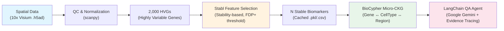

# Disease-Agnostic Spatial-MicroCKG Agent

**A Disease-Agnostic Neuroinflammation Infrastructure for Spatial Multi-Omics and Knowledge Graph-Driven Drug Discovery**

This pipeline processes spatial transcriptomics data to extract highly stable
neuroinflammation signatures using the Stabl algorithm, structures them into a
BioCypher-generated Micro-Clinical Knowledge Graph (Micro-CKG), and provides an
LLM interface with strict evidence traceability.

## Architecture



## Proof-of-Concept: TBI Spatial Transcriptomics

For this PoC, the pipeline ingests a public 10x Visium adult mouse brain
dataset. The Stabl algorithm applies L1-penalised logistic regression with
stability selection across 500 bootstrap iterations to objectively converge
2,000 HVGs down to a sparse set of the most stable biomarker genes.

## Project Structure

```
├── data/raw/               # Downloaded .h5ad spatial datasets
├── cache/                  # Cached Stabl results (.pkl, .csv)
├── assets/                 # Spatial H&E overlay plots (.png)
├── src/
│   ├── data_ingestion.py   # Dataset download (squidpy, GEO)
│   ├── spatial_pipeline.py # QC, HVG selection, Stabl, plotting
│   ├── biocypher_adapter.py# Micro-CKG construction (Biolink model)
│   └── llm_agent.py        # LangChain QA with evidence traceability
├── config/
│   └── schema_config.yaml  # BioCypher schema (Gene, CellType, Region)
├── notebooks/
│   └── Takeda_Panel_Demo.ipynb  # Deliverable notebook
├── pyproject.toml
├── uv.lock
└── README.md
```

## Setup

```bash
# 1. Install dependencies (creates .venv automatically)
uv sync --all-groups

# 2. Configure API keys
cp .env.example .env
# Edit .env and set GOOGLE_API_KEY=your_key_here

# 3. Register Jupyter kernel
uv run python -m ipykernel install --user --name spatial-microckg-agent --display-name "Spatial-MicroCKG"

# 4. Run the notebook
uv run jupyter lab notebooks/Takeda_Panel_Demo.ipynb
```

## Pipeline Steps

| Step | Module | Description |
|------|--------|-------------|
| 1 | `data_ingestion.py` | Download 10x Visium spatial dataset |
| 2 | `spatial_pipeline.py` | QC filtering, normalization, 2,000 HVG selection |
| 3 | `spatial_pipeline.py` | Stabl stability selection with caching |
| 4 | `spatial_pipeline.py` | Spatial H&E marker overlay plots |
| 5 | `biocypher_adapter.py` | Micro-CKG construction (NetworkX DiGraph) |
| 6 | `llm_agent.py` | Evidence-traced LLM queries via Google Gemini |

## LLM Provider Support

The agent is LLM-agnostic. Configure the provider in the notebook or via
environment variables:

| Provider | Model (default) | Env Variable |
|----------|----------------|--------------|
| Google Gemini (default) | `gemini-2.0-flash` | `GOOGLE_API_KEY` |
| OpenAI | `gpt-4o-mini` | `OPENAI_API_KEY` |

## Evidence Traceability

All LLM responses cite exact graph evidence:

```
(gene:Gfap) --[gene_cell_type_association, stability_score=0.8921, mean_expression=2.3451]--> (celltype:Cluster_3_Cortex)
```

If no evidence exists in the Micro-CKG, the agent responds:
*"No evidence found in the Micro-CKG for this query."*

## Key Technologies

- **Stabl** (Hédou et al., Nature Biotechnology 2024) — stability-based
  feature selection with automatic FDP+ thresholding
- **BioCypher** — ontology-mapped knowledge graph construction (Biolink model)
- **LangChain** — LLM orchestration with strict evidence-tracing prompts
- **scanpy / squidpy** — spatial transcriptomics processing and visualization

## License

MIT
