# Disease-Agnostic Spatial-MicroCKG Agent

**A Disease-Agnostic Neuroinflammation Infrastructure for Spatial Multi-Omics and Knowledge Graph-Driven Drug Discovery**

This pipeline processes spatial transcriptomics data to extract highly stable
neuroinflammation signatures using the Stabl algorithm, structures them into a
BioCypher-generated Micro-Clinical Knowledge Graph (Micro-CKG), and provides an
LLM interface with strict evidence traceability.

## Architecture

```mermaid
flowchart LR
    A["Spatial Data<br/>(10x Visium .h5ad)"] --> B["QC & Normalization<br/>(scanpy)"]
    B --> C["Unsupervised Stratified<br/>Downsampling (Leiden)"]
    C --> D["HVG Selection<br/>(top 2,000 genes)"]
    D --> E["ComBat Batch Correction<br/>(on HVG subset)"]
    E --> F["Stabl Feature Selection<br/>(200 bootstraps, FDP+ threshold)"]
    F --> G["N Stable Biomarkers<br/>(Cached .pkl/.csv)"]
    G --> H["BioCypher Micro-CKG<br/>(Gene ↔ CellType ↔ Region)"]
    H --> I["LLM QA Agent<br/>(Ollama / Gemini)"]

    style A fill:#e1f5fe
    style C fill:#fff9c4
    style F fill:#fff3e0
    style H fill:#e8f5e9
    style I fill:#fce4ec
```



## Proof-of-Concept: Mouse AD Spatial Transcriptomics (GSE203424)

For this PoC, the pipeline ingests 6 Visium spatial transcriptomics samples from
GEO [GSE203424](https://www.ncbi.nlm.nih.gov/geo/query/acc.cgi?acc=GSE203424):
3 **PSAPP×CO** (Alzheimer's disease model, Corn Oil vehicle) and 3 **WT×CO**
(Wild-Type healthy controls, Corn Oil vehicle). Tamoxifen intervention groups are
excluded.

**Unsupervised Stratified Downsampling** is applied to objectively preserve
spatial anatomical heterogeneity — a rapid PCA + Leiden clustering defines
anatomical strata, and spots are sampled proportionally from each stratum within
each biological replicate (1,000 spots/sample, 6,000 total). This prevents
under-representation of anatomically distinct regions such as the Hippocampus.

**Highly Variable Gene (HVG) selection** (top 2,000 genes) focuses the feature
space on genes with the highest biological variance, matching the input scale
validated in the Stabl Nature Biotech paper (1,000–35,000 features). ComBat
batch correction is then applied on this HVG subset to remove inter-sample
technical variation while preserving condition-driven signal.

The Stabl algorithm applies L1-penalised logistic regression with stability
selection across 200 bootstrap iterations to objectively distill the 2,000 HVGs
down to a sparse set of the most stable AD biomarker genes. HVG selection defines
the **initial candidate pool**; Stabl's stability selection subsequently distills
this pool to a sparse final biomarker set (typically comprising <2% of the input candidates).

## Project Structure

```
├── data/raw/               # Downloaded .h5ad spatial datasets
├── cache/                  # Cached Stabl results (.pkl, .csv), micro_ckg.graphml
├── assets/                 # Spatial / UMAP overlay plots (.png)
├── src/
│   ├── data_ingestion.py   # Dataset download (squidpy, GEO GSE203424)
│   ├── spatial_pipeline.py # QC, stratified downsampling, Stabl, plotting
│   ├── spatial_analytics.py# Moran's I, neighbourhood enrichment
│   ├── biocypher_adapter.py# Micro-CKG construction (Biolink model)
│   ├── external_knowledge.py# Orthologs, GO enrichment, ChEMBL drug targets
│   ├── graph_analytics.py  # Community detection, centrality, bridge genes
│   └── llm_agent.py        # LangChain QA with evidence traceability
├── config/
│   └── schema_config.yaml  # BioCypher schema (Gene, CellType, Region)
├── notebooks/              # Step-by-step analysis notebooks (see below)
├── run_pipeline.py         # CLI pipeline runner (all steps)
├── pyproject.toml
├── uv.lock
└── README.md
```

## Setup

```bash
# 1. Install dependencies (creates .venv automatically)
uv sync --all-groups

# 2. Configure API keys (optional — only needed for Google/OpenAI LLM providers)
cp .env.example .env
# Edit .env and set GOOGLE_API_KEY=your_key_here

# 3. Install Ollama for local LLM inference (recommended)
brew install ollama
ollama pull llama3.1:8b
ollama serve  # start the server

# 4. Register Jupyter kernel
uv run python -m ipykernel install --user --name spatial-microckg-agent --display-name "Spatial-MicroCKG"

# 5. Run the notebooks
uv run jupyter lab notebooks/
```

## Notebooks

The pipeline is designed to run as **5 sequential notebooks**, each producing
outputs consumed by the next. Run them in order (01 → 05).

| Notebook | Title | Description |
|----------|-------|-------------|
| `01_Data_Ingestion_QC.ipynb` | Data Ingestion & QC | Download 6 Visium samples from GEO GSE203424, QC filter, normalize, save `ad_preprocessed.h5ad` |
| `02_Stabl_Feature_Selection.ipynb` | Stabl Feature Selection | Stratified downsample → 2,000 HVG initial candidate pool → ComBat → Stabl (200 bootstraps) → final stable AD biomarkers (<2% of candidate pool) |
| `03_Spatial_Visualization.ipynb` | Spatial Visualization | Spatial/UMAP overlay of top Stabl markers + Prox1 (Hippocampus), Trem2, Gfap (AD) |
| `04_Knowledge_Graph.ipynb` | Knowledge Graph & Drug Discovery | Leiden clustering → Micro-CKG → Moran's I validation → ortholog mapping → GO enrichment → ChEMBL drug targets |
| `05_LLM_Agent.ipynb` | LLM Agent (Evidence-Traced QA) | Load Micro-CKG → Ollama `llama3.1:8b` → 3 drug-discovery queries with graph-evidence citations |

## Pipeline Steps

| Step | Module | Description |
|------|--------|-------------|
| 1 | `data_ingestion.py` | Download 6 Visium samples from GEO GSE203424 (3 WT×CO + 3 PSAPP×CO) |
| 2 | `spatial_pipeline.py` | QC filtering (≥200 genes/spot, <30% mito), normalization (10k CPM + log1p) |
| 3 | `spatial_pipeline.py` | Unsupervised Stratified Downsampling (Leiden-based, 1,000 spots/sample) |
| 4 | `spatial_pipeline.py` | HVG selection (2,000, initial candidate pool) → ComBat batch correction → Stabl stability selection (final biomarker set) |
| 5 | `spatial_pipeline.py` | Spatial marker overlay plots (including Prox1 anatomical verification) |
| 6 | `biocypher_adapter.py` | Micro-CKG construction (NetworkX DiGraph, Wilcoxon DE-filtered edges) |
| 7 | `spatial_analytics.py` | Spatial validation (Moran's I autocorrelation) |
| 8 | `external_knowledge.py`| Mouse→Human orthologs, GO enrichment, ChEMBL drug targets |
| 9 | `llm_agent.py` | Evidence-traced LLM queries |

## LLM Provider Support

The agent is LLM-agnostic. Configure the provider in the notebook or via
environment variables:

| Provider | Model (default) | Env Variable | Notes |
|----------|----------------|--------------|-------|
| **Ollama** (recommended) | `llama3.1:8b` | — | Local, free, 128K context. Requires `ollama serve` |
| Google Gemini | `gemini-2.0-flash` | `GOOGLE_API_KEY` | Cloud API |
| OpenAI | `gpt-4o-mini` | `OPENAI_API_KEY` | Cloud API |

## Evidence Traceability

All LLM responses cite exact graph evidence:

```
(gene:Gfap) --[gene_cell_type_association, stability_score=0.8921, mean_expression=2.3451]--> (celltype:Cluster_3_Cortex)
```

If no evidence exists in the Micro-CKG, the agent responds:
*"No evidence found in the Micro-CKG for this query."*

## Key Technologies

- **Stabl** (Hédou et al., Nature Biotechnology 2024) — stability-based
  feature selection with automatic FDP+ thresholding
- **BioCypher** — ontology-mapped knowledge graph construction (Biolink model)
- **LangChain** — LLM orchestration with strict evidence-tracing prompts
- **Ollama** — local LLM inference (llama3.1:8b, 128K context)
- **scanpy / squidpy** — spatial transcriptomics processing and visualization

## License

MIT
